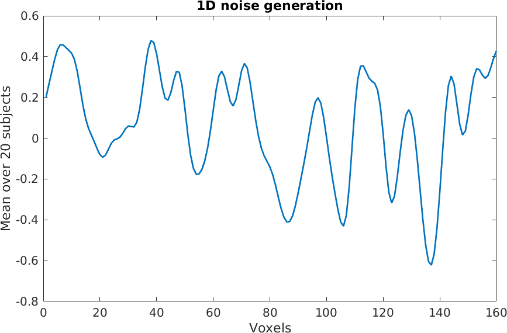
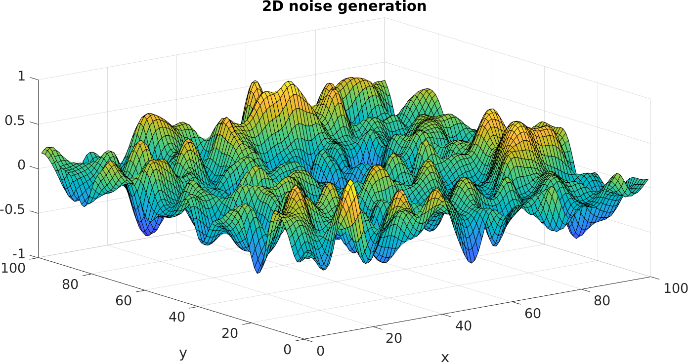
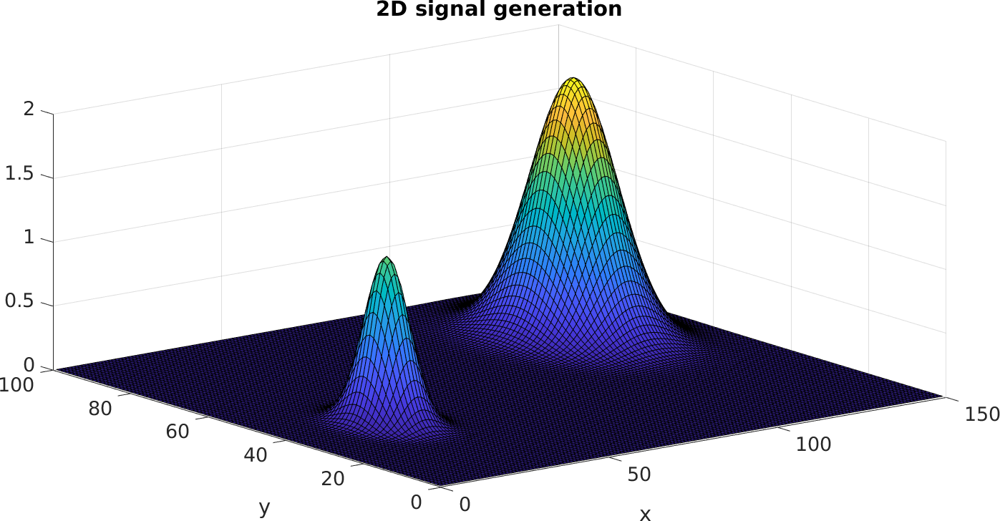

# RFTtoolbox (Beta Version): A toolbox designed for generation and analysis of random fields both continuously sampled and on a lattice.
NOTE: This is a BETA version of this toolbox. Many more random field functions will soon be added.
And some existing features will be tidied up. Watch this space! Feel free to use the functions available in your research.
However if you do please cite us.

## Table of contents
* [Introduction](#introduction)
* [Folder Structure](#folderstruct)
    * [Cluster_Size_Inference](#CLInf)
    * [Convolution_Fields](#Convfields)
    * [Peak_Inference](#PI)
    * [Random_Field_Generation](#RFfunctions)
    * [RFT_functions](#siggen)
    * [SPM_Functions](#power)
* [Set Up](#setup)
    * [Dependencies](#dependencies)

## Introduction <a name="introduction"></a>
The RFTtoolbox currently contains code to generate smooth Gaussian, t and 
F fields (with a zero or non-zero mean, the peaks of which can be specified) 
on a lattice of arbitrary size accounting for the edge effect.

It will soon contain code to perform clusterwise inference and analysis and thresholding 
using LKCS and to generate convolution fields as well as other functionalities.

## Folder Structure <a name="folderstruct"></a>

### Cluster Size Inference <a name="CLInf"></a>

A collection of functions to perform cluster size inference using random 
field theory. Many more functions will be added to this folder.

### Convolution Fields <a name="Convfields"></a>

Functions to generate and infer on convolution fields. 

### Peak Inference <a name="PI"></a>

A collection of functions to perform peak inference on random fields. 

### Random Field Generation <a name="RFfunctions"></a>

Functions to generate isotropic random fields (and to generate the signal 
for them if you'd like this to be non-zero).

#### noisegen.m
noisegen generates (a specified number of) smooth mean zero Gaussian fields 
with a specified dimension (D = 1, 2 or 3) that have variance 1 and are 
smoothed with an isotropic Gaussian kernel with given FWHM.

The mean of 20 Gaussian random fields generated on a grid of 1x160 with 
an isotropic Gaussian kernel with FWHM 6:
```
noise = noisegen(160,20,6);
plot(mean(noise,2), 'linewidth', 2)
```



The mean of 20 Gaussian random fields generated on a grid of 100x100 with 
an isotropic Gaussian kernel with FWHM 6:
```
Dim = [100,100]
noise = noisegen(Dim, 20, 6);
noise_mean = mean(noise,3);
surf(noise_mean)
```


#### genRF.m
genRF returns a set of isotropic random fields (either Gaussian, t or 
F-fields) which have a specified number of degrees of freedom and smoothing.


#### gensig.m
gensig generates signal with peaks at locations within an image of specified 
dimension D = 1,2 or 3. It provides control over the extent, shape and magnitude of each peak.
Below we provide a 2D illustration involving 2 peaks.

```
peak_magnitudes = [1.3,2]
radii = 3;
smoothing = [10,20];
image_dimensions = [100,150];
peak_locations =  {[40,30], [70,120]}

Sig = gensig(peak_magnitudes, radii, smoothing, image_dimensions, peak_locations);
surf(Sig)
```



## Set Up
If you have any difficulties getting this code to run or have any questions
feel free to get in touch with me via samuel.davenport(AT)stats.ox.ac.uk.